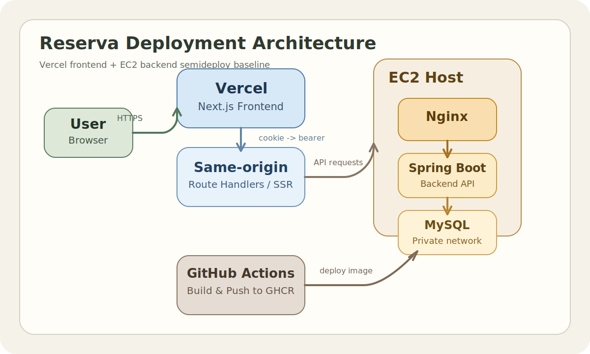

# Reserva

> 동시 요청이 몰리는 예약 상황에서도 정합성을 지키고, 공개 탐색 API의 성능 병목까지 개선하는 과정을 담은 이벤트·모임 예약 플랫폼입니다.

임시 배포 주소: https://reserva-frontend-psi.vercel.app/

## 프로젝트 소개

Reserva는 사용자와 주최자를 연결하는 이벤트·모임 예약 플랫폼입니다. 사용자는 이벤트를 탐색하고 예약할 수 있고, 주최자는 직접 이벤트를 만들고 예약 현황을 관리할 수 있습니다.

최근 모임 모집이나 사전 예약처럼 짧은 시간 안에 신청이 집중되는 서비스를 자주 보면서, 이런 흐름을 직접 다룰 수 있는 예약 서비스를 만들어보고 싶었습니다. 단순히 신청을 접수하는 수준이 아니라, 동시 요청 상황에서도 예약 가능 인원과 상태를 안정적으로 관리할 수 있는 백엔드 구조를 구현하는 것이 이 프로젝트의 출발점이었습니다.

이 프로젝트는 단순 CRUD 구현보다, 실제 서비스에서 중요한 문제를 직접 설계하고 검증하는 데 초점을 두었습니다. 특히 예약 도메인에서 핵심인 정합성과 동시성, 그리고 검색·필터·섹션·페이지네이션이 함께 붙는 조회 API의 성능 최적화를 중심 과제로 삼았습니다.

## 핵심 기술 과제

### 1. 예약 정합성과 동시성
- 예약 생성 시 `event_inventory`를 기준으로 남은 수량을 관리하고, 동시 요청 상황에서도 oversell 없이 동작하도록 설계했습니다.
- 현재 구현은 DB 락 기반 동시성 제어와 트랜잭션 처리에 집중했습니다.
- 예약 생성과 취소가 모두 재고 상태와 함께 일관되게 반영되도록 구성했습니다.

### 2. 조회 성능 최적화
- `GET /api/v1/events`를 중심으로 공개 이벤트 탐색 API의 병목을 측정하고 개선했습니다.
- count query 경량화, 조회 구조 분리, 검색 범위 축소를 통해 응답 성능을 단계적으로 개선했습니다.
- 기능 구현에 그치지 않고, 측정 기반으로 문제를 발견하고 개선하는 과정까지 프로젝트에 담았습니다.

### 3. 인증 구조
- 인증은 JWT 기반으로 구성하고, Google OAuth 로그인도 같은 인증 계약으로 연결했습니다.
- 프론트엔드가 httpOnly 쿠키를 관리하고, 서버 런타임과 route handler에서 백엔드로 bearer 토큰을 전달하는 구조를 사용했습니다.

## 구현 기능

### 사용자 기능
- 이벤트·모임 목록 조회
- 검색, 카테고리 필터, 섹션별 탐색, 페이지네이션
- 이벤트 상세 조회 및 예약
- 내 예약 목록 조회, 상세 조회, 예약 취소
- 찜 추가 및 해제
- 대시보드에서 최근 활동과 요약 정보 확인

### 주최자 기능
- 이벤트 생성
- 내가 만든 이벤트 목록 조회
- 예약 오픈 전 이벤트 수정
- 예약이 열리기 전이고 예약 내역이 없을 때 이벤트 삭제

### 인증 기능
- 이메일/비밀번호 회원가입 및 로그인
- Google OAuth 로그인
- JWT 기반 보호 API 접근

## 성능 개선 요약

공개 이벤트 탐색 API를 대상으로 `k6`와 대량 시드 데이터를 사용해 `1000 / 5000 / 10000` 이벤트 규모에서 부하 테스트를 진행했습니다. 특히 `10000건` 구간에서 병목이 크게 드러났고, 이를 기준으로 QueryDSL 조회 경로를 개선했습니다.

| 시나리오 | 개선 전 p95 | 1차 개선 p95 | 최종 p95 |
| --- | ---: | ---: | ---: |
| 기본 목록 | 540.80ms | 233.59ms | 217.58ms |
| 검색 | 683.15ms | 311.52ms | 204.15ms |
| trending | 619.43ms | 220.01ms | 202.87ms |

적용한 핵심 개선:
- count query에서 불필요한 join 제거
- 페이지 대상 id를 먼저 구한 뒤 필요한 데이터만 fetch join하도록 조회 구조 분리
- 검색 predicate에서 비용이 큰 범위를 축소

상세 내용은 [성능 테스트 리포트](./docs/operations/performance-test-report-2026-03-29.md)에서 확인할 수 있습니다.

## 기술 스택

- Frontend: Next.js App Router, React, TypeScript, Tailwind CSS
- Backend: Spring Boot, Spring Security, Spring Data JPA, QueryDSL, Flyway
- Database: MySQL
- Infra: Vercel, EC2, Nginx, Docker Compose, GitHub Actions, GHCR

## 배포 구조



배포 흐름 요약:
- 사용자는 Vercel에 배포된 Next.js 프론트엔드에 접속합니다.
- 프론트엔드의 same-origin route handler와 서버 런타임이 인증 쿠키를 기준으로 백엔드에 요청을 전달합니다.
- 백엔드는 EC2 위에서 Spring Boot와 Nginx 조합으로 운영되고, MySQL은 내부 네트워크에서 관리합니다.
- GitHub Actions가 백엔드 이미지를 빌드해 GHCR에 푸시하고, EC2에서 이를 pull 받아 재배포하는 흐름을 기준으로 구성했습니다.

## 아키텍처 요약

### 구성 요소
- Frontend: Next.js App Router 기반 웹 애플리케이션으로 사용자 화면, 주최자 화면, 인증 흐름을 담당합니다.
- Backend: Spring Boot 기반 API 서버로 인증, 이벤트, 예약, 찜, 대시보드, 내 이벤트 기능을 제공합니다.
- Database: MySQL과 Flyway를 사용해 데이터 저장과 스키마 버전 관리를 담당합니다.
- Infra: Vercel, EC2, Nginx, Docker Compose, GitHub Actions, GHCR 조합으로 운영합니다.

### 요청 흐름
1. 사용자가 Vercel에 배포된 프론트엔드에 접속합니다.
2. 프론트엔드의 same-origin route handler와 서버 런타임이 인증 쿠키를 기준으로 백엔드 API를 호출합니다.
3. 백엔드는 Spring Security의 stateless JWT 필터 체인으로 보호 API를 처리합니다.
4. 예약 요청은 재고 상태를 검증하고 갱신한 뒤 예약 생성까지 같은 흐름 안에서 처리합니다.
5. 공개 이벤트 조회는 QueryDSL 기반 동적 조건 조합으로 목록과 섹션 데이터를 반환합니다.

### 설계 포인트
- 예약 정합성 우선: 이벤트 정보와 재고 상태를 분리하고, 예약 생성/취소가 같은 흐름 안에서 반영되도록 구성했습니다.
- 조회 최적화 가능성 확보: 검색, 필터, 섹션, 페이지네이션이 결합된 공개 이벤트 조회를 QueryDSL 중심으로 설계했습니다.
- 프론트엔드 중심 인증 경계: 프론트엔드가 httpOnly 쿠키를 관리하고 bearer 토큰을 백엔드에 전달하는 구조를 사용했습니다.

## 프로젝트 구조

```text
reserva/
├─ frontend/    # Next.js 기반 프론트엔드
├─ backend/     # Spring Boot API, 인증, 예약, 조회 로직
├─ docs/        # 제품/설계/운영 문서
├─ infra/       # 배포 및 운영 자산
├─ perf/        # k6 기반 성능 테스트 스크립트
└─ prototype/   # 초기 프로토타입 참고 자료
```

## 실행 방법

### Backend
```powershell
cd backend
.\run-local.ps1
```

- 로컬 설정은 `backend/.env`를 기준으로 합니다.

### Frontend
```powershell
cd frontend
npm install
npm run dev
```

- 프론트엔드 환경 변수는 `frontend/.env.example`를 참고합니다.
- `BACKEND_BASE_URL`을 통해 로컬 또는 배포 백엔드를 연결할 수 있습니다.

## 추가 문서

- [API 요약 문서](./docs/ko/api-spec.md)
- [DB 요약 문서](./docs/ko/db.md)

## 회고 및 다음 단계

이 프로젝트에서는 예약 도메인에서 가장 중요한 문제를 정합성과 조회 성능이라고 보고 설계를 진행했습니다. 현재는 DB 락 기반 동시성 제어와 QueryDSL 기반 조회 최적화에 집중했으며, 이후에는 운영 안정화와 대기열·트래픽 제어 같은 확장 포인트까지 발전시킬 수 있습니다.
