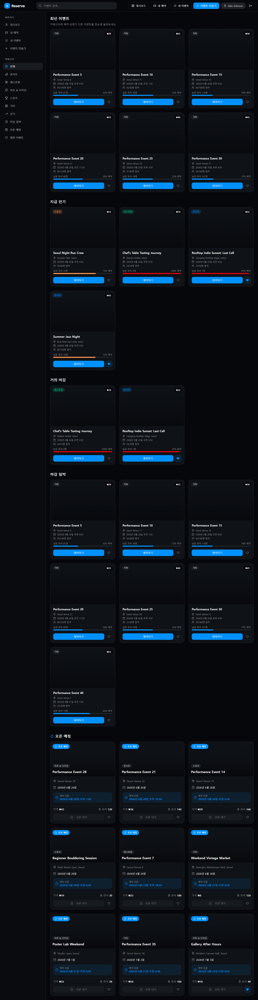
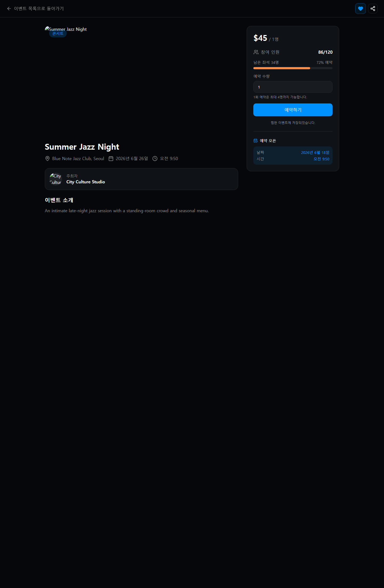
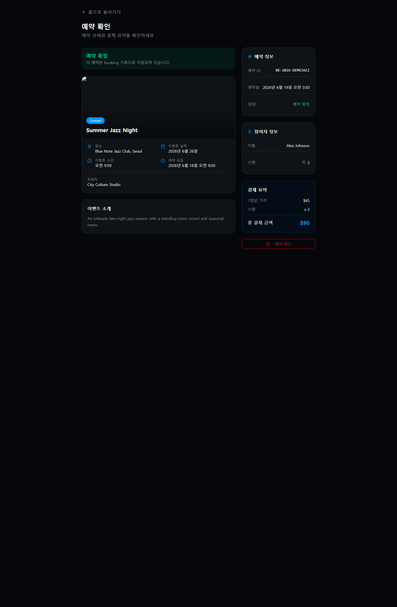
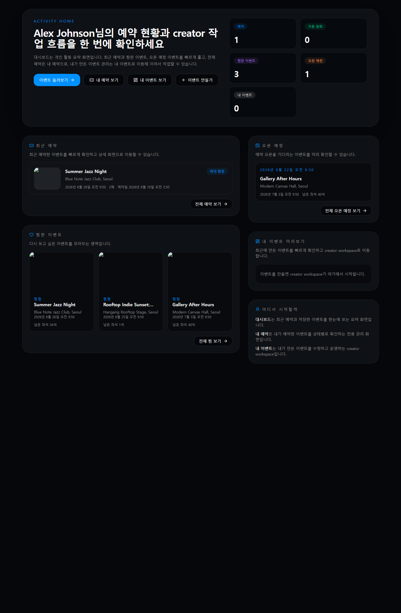
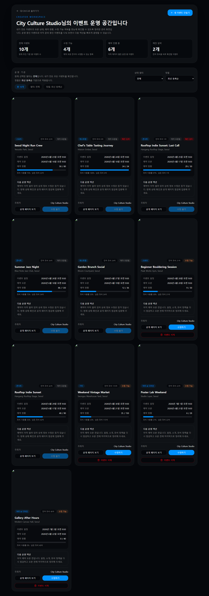
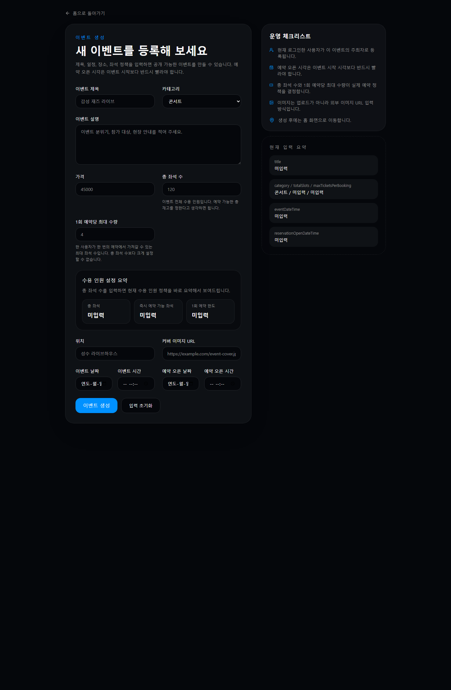

# Reserva

Reserva는 사용자가 이벤트를 탐색하고 예약하며, 주최자가 이벤트와 예약 현황을 관리할 수 있는 이벤트 예약 서비스입니다.

단순 CRUD 구현을 넘어 예약 가능 수량을 별도 재고로 관리하고, 여러 사용자가 마지막 좌석을 동시에 요청하는 상황에서도 초과 예약이 발생하지 않도록 트랜잭션 경계를 설계했습니다. 공개 배포 주소에 의존하지 않고 로컬 더미 데이터와 재현 가능한 검증 스크립트로 제품을 확인할 수 있습니다.

## 제품 화면

아래 화면은 `SEED_DEMO_DATA=true`로 생성한 로컬 더미 데이터를 기준으로 캡처했습니다.

### 이벤트 탐색과 예약

| 이벤트 탐색 | 이벤트 상세 및 예약 |
| --- | --- |
|  |  |

카테고리, 검색어, 섹션별로 이벤트를 탐색하고 상세 화면에서 남은 좌석과 예약 오픈 시간을 확인한 뒤 티켓 수량을 선택할 수 있습니다.

### 예약 확인과 사용자 대시보드

| 예약 상세 | 사용자 대시보드 |
| --- | --- |
|  |  |

예약 완료 후 예약 코드, 상태, 참여자 정보와 결제 요약을 확인할 수 있습니다. 대시보드에서는 최근 예약, 찜한 이벤트, 예약 오픈 예정 이벤트를 한 번에 확인합니다.

### 주최자 이벤트 운영

| 내 이벤트 관리 | 이벤트 생성 |
| --- | --- |
|  |  |

주최자는 전체 좌석과 예약 현황을 확인하고, 예약 상태에 따라 이벤트를 수정하거나 삭제할 수 있습니다. 이벤트 생성 화면에서는 일정, 장소, 가격, 총 좌석 수와 1회 예약 한도를 함께 설정합니다.

## 주요 기능

### 사용자

- 공개 이벤트 목록 조회 및 키워드 검색
- 카테고리, 추천 섹션, 페이지 기반 탐색
- 이벤트 상세 조회 및 티켓 예약
- 예약 목록과 예약 상세 확인 및 취소
- 관심 이벤트 찜 추가 및 해제
- 최근 예약과 예약 오픈 예정 이벤트를 모은 대시보드

### 주최자

- 이벤트 생성
- 내가 만든 이벤트 목록과 좌석 현황 조회
- 예약 상태에 따른 이벤트 수정
- 예약 이력이 없는 이벤트 삭제

### 인증

- 이메일과 비밀번호 기반 회원가입 및 로그인
- Google OAuth 로그인
- JWT 기반 보호 API 접근
- 프론트엔드 httpOnly 쿠키와 Route Handler를 통한 토큰 전달

## 기술 스택과 선택 이유

| 영역 | 기술 | 사용 이유 |
| --- | --- | --- |
| Frontend | Next.js App Router, React, TypeScript | 서버와 클라이언트 컴포넌트를 역할별로 나누고, 화면과 API 응답 타입을 일관되게 관리했습니다. |
| Styling | Tailwind CSS | 이벤트 카드, 대시보드, 폼의 디자인 규칙을 유틸리티 클래스 기반으로 빠르게 반복 적용했습니다. |
| Backend | Spring Boot, Spring Security | 도메인별 API 구조, 입력 검증, 인증 필터와 트랜잭션 경계를 구성했습니다. |
| Persistence | Spring Data JPA, QueryDSL | 예약 도메인은 JPA로 모델링하고, 검색 조건이 조합되는 이벤트 목록은 QueryDSL 동적 쿼리로 구현했습니다. |
| Migration | Flyway | 데이터베이스 스키마 변경을 애플리케이션 버전과 함께 관리합니다. |
| Database | MySQL | 예약과 좌석 재고 변경을 하나의 트랜잭션으로 처리하기 위해 사용했습니다. |
| Cache/Infra | Redis, Docker Compose | 로컬 의존성을 동일한 구성으로 재현하고 확장 가능한 캐시 기반을 마련했습니다. |
| Verification | JUnit, Gradle, Next.js Build, Headless Chrome | 백엔드 동작, 프론트 타입과 빌드, 실제 브라우저 화면을 각각 검증합니다. |

## 핵심 설계: 동시 예약 정합성

예약 서비스에서는 여러 사용자가 마지막 좌석을 동시에 요청하더라도 판매 수량이 전체 좌석을 넘지 않아야 합니다.

Reserva는 이벤트 정보와 좌석 재고를 분리하고, 예약 생성과 재고 차감을 같은 트랜잭션 안에서 처리합니다. 예약 취소 시에도 예약 상태와 좌석 반환이 함께 반영됩니다.

로컬 검증 스크립트로 매진된 이벤트에 8개의 예약 요청을 동시에 전송한 결과입니다.

| 항목 | 결과 |
| --- | ---: |
| 동시 요청 수 | 8 |
| 요청당 티켓 수 | 2 |
| 생성된 예약 | 0 |
| 예상된 충돌 응답 | 8 |
| 예상하지 못한 실패 | 0 |

```powershell
powershell -ExecutionPolicy Bypass -File scripts\readme-concurrency-check.ps1 `
  -EventId evt_demo_chef_waitlist `
  -RequestCount 8 `
  -TicketCount 2
```

여기서 확인하려는 지표는 응답 속도가 아니라 정합성입니다. 남은 좌석을 초과하는 요청은 `409 Conflict`로 거절되고 재고는 허용된 범위를 벗어나지 않아야 합니다.

## 로컬 실행

### 1. MySQL과 Redis 실행

```powershell
docker compose -f infra/local/compose.yml up -d
```

로컬 기본 포트는 MySQL `3310`, Redis `6379`입니다.

### 2. 백엔드 환경 변수

`backend/.env`에 다음 값을 설정합니다.

```env
DB_HOST=127.0.0.1
DB_PORT=3310
DB_NAME=reserva
DB_USERNAME=root
DB_PASSWORD=root
REDIS_HOST=localhost
REDIS_PORT=6379
JWT_SECRET=local-readme-demo-secret-local-readme-demo-secret
FRONTEND_ORIGIN=http://localhost:3000
SEED_DEMO_DATA=true
```

### 3. 백엔드 실행

```powershell
cd backend
.\gradlew.bat --no-daemon bootRun
```

### 4. 프론트엔드 실행

```powershell
cd frontend
npm install
npm run dev
```

브라우저에서 `http://localhost:3000`으로 접속합니다.

### 데모 계정

| 역할 | 이메일 | 비밀번호 |
| --- | --- | --- |
| 사용자 | `alex@example.com` | `dev-password` |
| 주최자 | `creator@example.com` | `dev-password` |

## README 화면 다시 캡처하기

백엔드와 프론트엔드를 실행한 상태에서 다음 명령을 사용합니다.

```powershell
node scripts\capture-readme-screenshots.mjs
```

스크립트는 사용자와 주최자 계정으로 로그인한 뒤 headless Chrome에서 주요 화면 6개를 `docs/assets/readme/`에 저장합니다.

필요한 경우 실행 주소와 출력 경로를 변경할 수 있습니다.

```powershell
$env:FRONTEND_BASE_URL="http://localhost:3000"
$env:BACKEND_BASE_URL="http://localhost:8080"
$env:README_SCREENSHOT_DIR="docs/assets/readme"
```

## 프로젝트 구조

```text
reserva/
├─ frontend/    # Next.js 화면, Route Handler, UI 컴포넌트
├─ backend/     # Spring Boot API, 인증, 이벤트, 예약, 찜 도메인
├─ docs/        # 제품 및 운영 문서, README 이미지
├─ infra/       # 로컬 및 배포 인프라 구성
├─ perf/        # 부하 테스트 스크립트
└─ prototype/   # 초기 화면 프로토타입
```

## 검증

```powershell
cd backend
.\gradlew.bat test

cd ..\frontend
npm run build
```

README 데모는 단위 테스트와 빌드에 더해 다음 흐름으로 확인합니다.

- Docker Compose로 MySQL과 Redis 실행
- `SEED_DEMO_DATA=true`로 백엔드 실행
- 사용자와 주최자 주요 화면 브라우저 확인
- README 스크린샷 재생성
- 동시 예약 검증 스크립트 실행

## 문서

- [API 요약](./docs/ko/api-spec.md)
- [데이터베이스 요약](./docs/ko/db.md)
- [로컬 인프라 실행](./infra/local/README.md)
